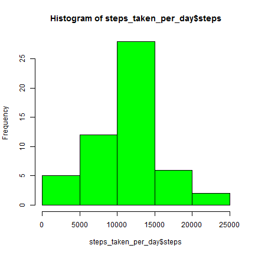
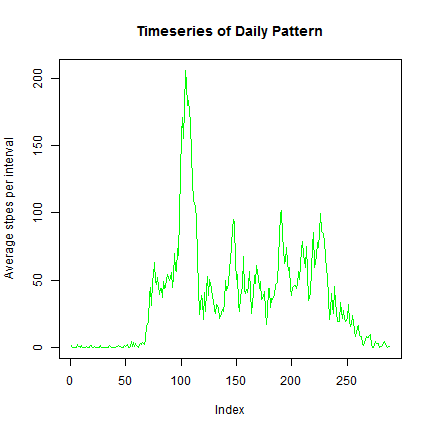
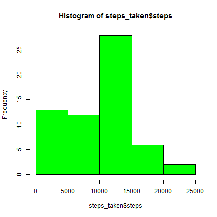
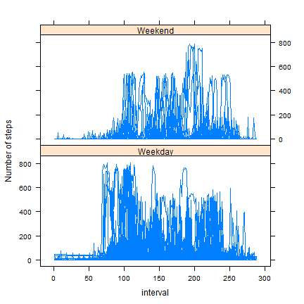

# Reproducible Research: Peer Assessment 1


## Loading and preprocessing the data
* Dataset used for this Assessment (activity.zip) is present in the forked git repository.
* Lets load the csv file if already uncompressed, else lets unzip the "activity.zip" and load the dataset.


```r
fileName <- "activity.csv"
if(file.exists(fileName)){
    data <- read.csv(fileName)
}else{
    unzip("activity.zip")
    data <- read.csv(fileName)
}
```
* The date column is converted to Date type
* The inverval column is converted to factor type. 


```r
data$date <- as.Date(data$date) #Converting data column to Date type
data$interval <- as.factor(data$interval) #Converting interval column to factor type
```

* Lets look at the structure and summary of data

```r
str(data)
```

```
## 'data.frame':	17568 obs. of  3 variables:
##  $ steps   : int  NA NA NA NA NA NA NA NA NA NA ...
##  $ date    : Date, format: "2012-10-01" "2012-10-01" ...
##  $ interval: Factor w/ 288 levels "0","5","10","15",..: 1 2 3 4 5 6 7 8 9 10 ...
```

```r
summary(data)
```

```
##      steps            date               interval    
##  Min.   :  0.0   Min.   :2012-10-01   0      :   61  
##  1st Qu.:  0.0   1st Qu.:2012-10-16   5      :   61  
##  Median :  0.0   Median :2012-10-31   10     :   61  
##  Mean   : 37.4   Mean   :2012-10-31   15     :   61  
##  3rd Qu.: 12.0   3rd Qu.:2012-11-15   20     :   61  
##  Max.   :806.0   Max.   :2012-11-30   25     :   61  
##  NA's   :2304                         (Other):17202
```

## What is mean total number of steps taken per day?

* calculating total number of steps taken per day

```r
steps_taken_per_day <- aggregate(steps ~ date, data, sum)
```

* Lets see the histogram of steps taken per day

```r
hist(steps_taken_per_day$steps, col = "green")
```

 

* **Mean** of steps taken per day

```r
mean(steps_taken_per_day$steps)
```

```
## [1] 10766
```

* **Median** of steps taken per day

```r
median(steps_taken_per_day$steps)
```

```
## [1] 10765
```

## What is the average daily activity pattern?
* Calculating average number of steps taken per interval

```r
steps_per_interval <- aggregate(steps ~ interval, data, mean)
```

* Plotting timeseries of average daily activity pattern

```r
plot(steps_per_interval$steps, col = "green", type = "l", main = "Timeseries of Daily Pattern", ylab = "Average stpes per interval")
```

 

* Maximum number of steps in which 5 minute interval?


```r
steps_per_interval[max(steps_per_interval$steps),1]
```

```
## [1] 1705
## 288 Levels: 0 5 10 15 20 25 30 35 40 45 50 55 100 105 110 115 120 ... 2355
```

## Imputing missing values

Imputing a non-sophasticated method for NAs, Replacing NA's with zero


```r
steps <- data$steps
steps[is.na(steps)] <- 0
data$steps <- steps
```

* calculating total number of steps taken per day

```r
steps_taken <- aggregate(steps ~ date, data, sum)
```

* Lets see the new histogram of steps taken per day

```r
hist(steps_taken$steps, col = "green")
```

 

* **Mean** of steps taken per day

```r
mean(steps_taken$steps)
```

```
## [1] 9354
```

* **Median** of steps taken per day

```r
median(steps_taken$steps)
```

```
## [1] 10395
```

## Are there differences in activity patterns between weekdays and weekends?

* Creating column weekday

```r
data$weekday <- as.factor(weekdays(data$date))
```

 * Creating one more column for weekday and weekend

```r
data$day <- NA
data[data$weekday %in% c("Saturday", "Sunday"),5] <- "Weekend"
data[!data$weekday %in% c("Saturday", "Sunday"),5] <- "Weekday"
data$day <- as.factor(data$day)
```

* Comparison of activities of weekday and weekend

```r
library(lattice)
panel.smoother <- function(x, y) {
   panel.loess(x, y)  # show smoothed line 
}
data$interval <- as.numeric(data$interval)
xyplot(steps ~ interval |day, data = data, layout = c(1,2), type = "l", ylab = "Number of steps")
```

 
